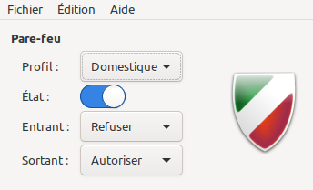
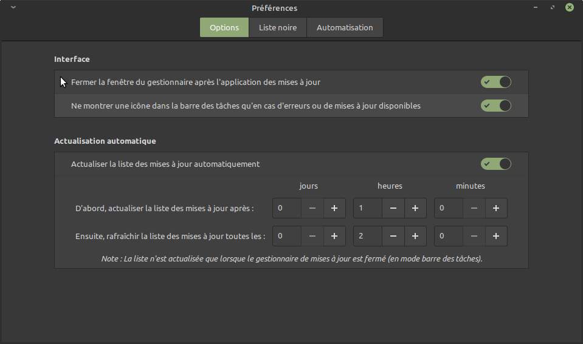
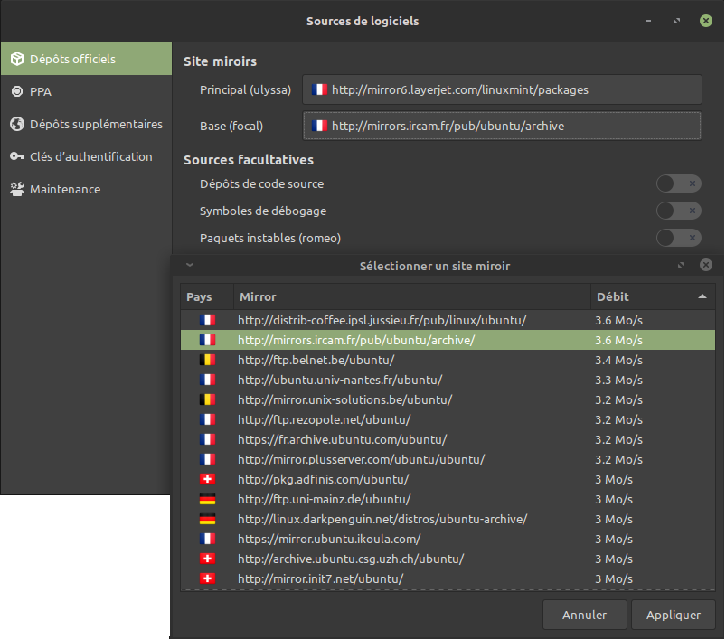
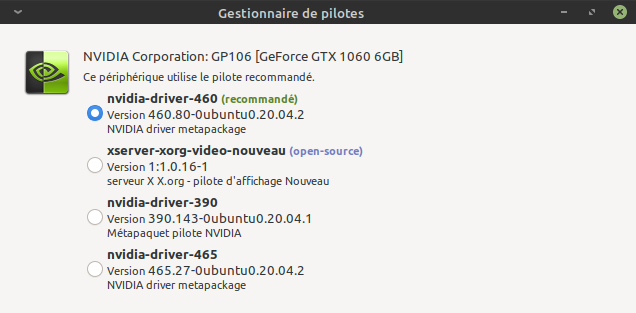
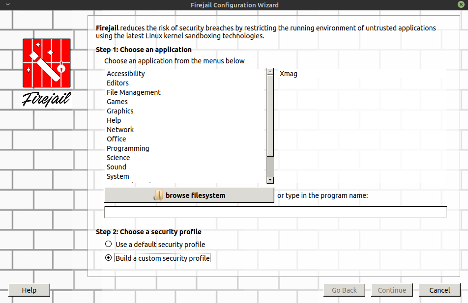
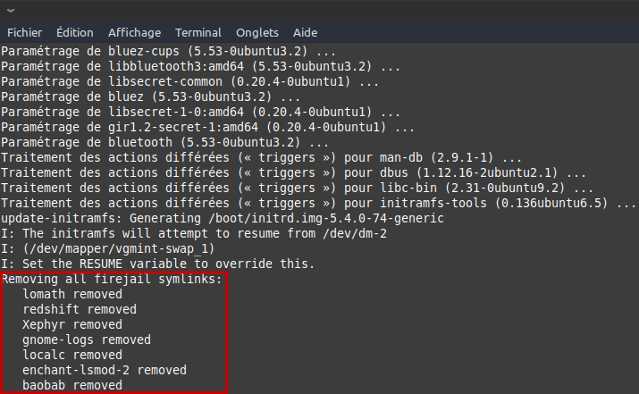

English version [below](#a-pretty-secure-and-usable-linux-distribution) !

<br />

# Une distribution Linux sécurisée et simple
Au travers de ce dépôt je documente comment j'ai installé, personnalisé et sécurisé mon installation de Linux Mint XFCE. J'ai essayé d'obtenir un résultat avec des interfaces utilisateurs au maximum cohérentes, un système pratique et facile à maintenir tout en ayant une bonne sécurité.

Au cours de mes recherches j'ai dû faire certains compromis après divers tests ; je partage donc ici ma configuration personnalisée qui ne vous conviendra peut-être pas. En fonction des pistes que j'ai creusé j'essaye de fournir des alternatives à mes décisions finales afin que vous puissiez faire vos propres choix.

# Installation de Linux Mint 21 édition XFCE
## Choisir la version
:warning: Ici je détaille à date la version que j'ai installée ; depuis d'autres versions sont sans doute sorties ! Je vous conseille de toujours vous référer à la [documentation officielle](https://linuxmint-installation-guide.readthedocs.io/fr/latest/) de la version que vous installez afin de bénificier de l'aide la plus à jour.

:warning: Dès cette phase un choix "important" est effectué : celui de l'environnement graphique. En effet [XFCE](https://xfce.org/?lang=fr) n'est pas [Mate](https://mate-desktop.org/fr/), ni Cinnamon créé par les développeurs de Mint.

La documentation officielle propose un [comparatif rapide](https://linuxmint-installation-guide.readthedocs.io/fr/latest/choose.html) de ces environnements. Si ces environnements ne vous conviennent pas, sachez qu'il en existe d'autres comme :
- [Gnome](https://www.gnome.org/)
- [KDE](https://kde.org/fr/)
- [Enlightment](https://www.enlightenment.org/)
- ...

Il vous faudra alors vous diriger vers d'autres systèmes d'exploitation si c'est le cas, sauf si vous vous sentez suffisament confiant pour installer un environnement non supporté (ce qui est possible comme indiqué [ici](https://linoxide.com/install-gnome-on-linux-mint/) ; attention je pense que cela peut poser problème en fonction des mises à jour !)

## Installation du système
L'installation de Linux Mint est assez facile ; la création du support USB d'installation est détaillé [ici](https://linuxmint-installation-guide.readthedocs.io/fr/latest/burn.html) si nécessaire. Pour ma part j'ai suivi l'installateur graphique sans personnalisation exceptionnelle.
J'ai choisi de chiffrer l'ensemble du disque système (ayant un disque pleinement disponible), attention aux manipulations lors de la phase de partitionnement si vous souhaitez effectuer un dual-boot Windows par exemple. La documentation [officielle](https://linuxmint-installation-guide.readthedocs.io/fr/latest/install.html) contient de bonnes bases mais si vous n'êtes pas sûr n'hésitez pas à faire des recherches complémentaires sur le sujet.

Le chiffrement complet du système protège votre machine d'un accès à vos fichiers dans le cas d'un vol de portable par exemple ; en effet lors du démarrage un mot de passe est requis et sans celui-ci il est impossible de consulter le contenu du disque même via un live boot. :warning: Cette mécanique n'est en aucun cas une protection contre les malwares ! Une fois le déchiffrement effectué et la phase de boot passée, les fichiers sont accessibles de manière classique donc si la machine est compromise cela ne change rien.

D'après mon expérience l'indication concernant l'agencement du clavier lors de la saisie du mot de passe de chiffrement n'est plus d'actualité (au moins sur Linux Mint 20.1 "Ulyssa"). En effet ce choix d'agencement est désormais en amont dans la phase de partionnement et lors de la saisie au démarrage du système l'agencement du clavier est bien celui choisi (Français (azerty) pour ma part).

## Configuration post-installation
A la première ouverture de session, une fenêtre s'ouvre pour suggérer plusieurs personnalisations à effectuer. Voici ce qui m'a paru prioritaire :
1. Activer le [pare-feu](#pare-feu-par-défaut)
2. Paramétrer les [mises à jour et sources de logiciels](#mises-à-jour-et-sources-de-logiciels)
3. Choisir le bon [pilote de carte graphique](#pilote-de-la-carte-graphique)
4. Et enfin [régler la mise en veille et extinction](#gestion-de-la-mise-en-veille) de l'écran

Pour les autres sujets (personnalisation, sécurisation, ...), je m'y suis attaqué en fonction de mon temps libre et de mes envies. Vous pouvez retrouver ces catégories via la table des matières générée par GitHub.

### Pare-feu par défaut
Le pare-feu fourni par défaut avec Linux Mint est [ufw](https://help.ubuntu.com/community/UFW) avec son interface graphique [Gufw](https://help.ubuntu.com/community/Gufw). Comme son nom l'indique, ufw (Uncomplicated Firewall) est fait pour être simple d'usage. La simple activation de ce pare-feu répond aux besoins de l'utilisateur moyen hors entreprise. Pour l'activer il faut se rendre dans le menu `Paramètres` > `Configuration du pare-feu` ; ce réglage étant réservé aux utilisateurs habilités, il faut donc saisir son mot de passe.

Personnellement je choisi la configuration la plus basique possible comme je compte compléter le pare-feu avec d'autres solutions pour protéger mon poste. N'utilisant pas de service particulier (avec écoute sur port externe notamment), le refus des connexions entrantes et l'autorisation des connexions sortantes me convient tout à fait. Il ne faut pas oublier de faire glisser la coche pour activer ufw.



### Mises à jour et sources de logiciels
Concernant la gestion des mises à jour, j'ai validé la recherche automatique lors de l'invitation à la première connexion. On peut vérifier que l'actualisation automatique est bien activée et avec quelle périodicité en passant par le menu `Système` > `Gestionnaire de mises à jour` puis dans la fenêtre `Édition` > `Préférences` et enfin onglet `Options`.



Au niveau des sources de logiciels j'ai également configuré les miroirs afin d'utiliser ceux les plus performants selon ma localisation. On accède à ces réglages par le menu `Système` > `Sources de logiciels` (ce qui nécessite les droits administrateur). En cliquant dans la liste déroulante pour le miroir `Principal (ulyssa)` ou `Base (focal)`, la vitesse de téléchargement depuis chaque miroir s'affiche ce qui permet de sélectionner les plus appropriés.



### Pilote de la carte graphique
J'ai une carte graphique Nvidia dont la gestion peut-être compliquée selon les drivers disponibles sur les différentes distributions GNU/Linux. Le driver Nouveau m'a notamment posé plusieurs soucis précédemment, et malgré que je préfère utiliser des logiciels open-source et/ou libres, dans ce cas j'installe désormais le pilote propriétaire.

Pour ce faire il faut se rendre dans le menu `Système` > `Gestionnaire de pilotes` et il n'y a plus qu'à cocher le pilote propriétaire recommandé. L'application de ce choix prend quelques minutes le temps de faire le téléchargement et l'installation.



### Gestion de la mise en veille
L'un des paramétrages que j'effectue en premier sur un nouveau système est la gestion de l'extinction de l'écran et de la mise en veille. Je déteste retrouver mon PC éteint alors que j'avais lancé un téléchargement, script, etc. Personnellement je n’aime pas avoir de mise en veille automatique, cependant je veux éteindre l’écran au bout de 5 minutes d’absence (avec verrouillage de la session). Sur Linux Mint c'est assez facile, il faut cliquer sur l’icône d'un éclair dans la barre de menu puis choisir `Paramètre du gestionnaire d'alimentation`. Au niveau de l'onglet `Général` de la fenêtre qui s'ouvre, je sélectionne `Ne rien faire` pour chaque option afin qu'aucun bouton ne déclenche la mise en veille. Dans l'onglet `Écran` j'active la gestion de l'alimentation de celui-ci, et je choisi d'éteindre l'écran après 5 minutes d'inactivité (ce qui correspond à l'option `Écran vide après`) ; je règle à `Jamais` pour le reste. Enfin dans l'onglet `Sécurité` j'active le verrouillage automatique de l'écran quand l'économiseur d'écran se déclenche, avec 1 seconde de différé.

## Sécurisation du système
### Bac à sable d'application
#### Introduction à la notion de bac à sable
Un bac à sable permet de ne fournir à une application que ce dont elle a besoin pour fonctionner, sans pouvoir accéder à toutes les fonctions du système d'exploitation ce qui limite le risque de failles de sécurité. A titre d'illustration il est ainsi possible de :
- cloisonner l'accès aux documents de l'utilisateur (`/home/[utilisateur]/Documents`)
- masquer le contenu réel de certains dossier comme `/dev`, `/proc`, ... (CF cette [documentation](https://linuxhandbook.com/linux-directory-structure/) pour le détail de l'arborescence Linux)
- empêcher l'accès au réseau à une application qui n'en a pas besoin
- si l'application doit accéder au réseau, lui créer une nouvelle pile réseau propre afin de l'empêcher de voir les autres communications
- donner une vue virtuelle du kernel partagé
- ...

Voici deux solutions de type bac à sable très connues et recommandées notamment par l'ANSSI dans le guide de [configuration GNU/Linux](https://www.ssi.gouv.fr/uploads/2016/01/linux_configuration-fr-v1.2.pdf) :
- [AppArmor](https://gitlab.com/apparmor/apparmor/-/wikis/GettingStarted)
- [SELinux](https://selinuxproject.org/page/Main_Page)

Cependant bien que je sois relativement attentif à la sécurité, ces solutions me paraissent "overkill" (dans le sens trop complexe à mettre en place et trop limitant au regard de mon [modèle de menace](https://fr.wikipedia.org/wiki/Mod%C3%A8le_de_menace)) pour un usage domestique.

#### Firejail
Lors d'un essai de Manjaro, j'ai découvert [Firejail](https://firejail.wordpress.com/) qui est recommandé dans le [wiki sécurité](https://wiki.manjaro.org/index.php/Linux_Security#Sandboxing) de la distribution. Il s'agit depuis de la solution de bac à sable que j'utilise au quotidien. Son utilisation est très simple puisque de nombreux profils d'application existent, et hormis une application en particulier (VSCodium) je n'ai jamais rencontré de soucis avec. Il existe d'ailleurs un petit [guide pour Linux Mint](https://firejail.wordpress.com/2017/05/15/linux-mint-sandboxing-guide/) permettant de mieux appréhender son fonctionnement et sa simplicité pour l'utilisateur.

Pour le mettre en oeuvre il suffit d'installer les paquets suivants (via la logithèque en mode graphique ou le terminal avec `sudo apt install [nom du paquet]`) :

| Paquet | Objet |
| --- | --- |
| Firejail | Le bac à sable en lui-même |
| firejail-profiles | Des profils supplémentaires à ceux de base pour une prise en charge de plus d'application par défaut |
| Firetools | L'interface graphique de Firejail pour voir les bacs à sable, lancer une application, ... |

Point d'attention lors de l'installation d'une nouvelle application, afin que celle-ci soit prise en compte par Firejail (si un profil correspondant existe), il faut exécuter la commande `sudo firecfg`. Si aucun profil n'existe, on peut lancer l'application depuis l'interface Firetools après avoir défini les contraintes :



Ou bien rédiger un profil spécifique dans `~/.config/firejail/` à l'aide de la [documentation dédiée](https://firejail.wordpress.com/documentation-2/building-custom-profiles/).

Comme indiqué précédemment la prise en compte d'une nouvelle application est manuelle ; il est possible d'automatiser cela grâce à un crochet post-installation dont le but sera d'exécuter la commande `sudo firecfg` après chaque nouvelle installation. Voici comment procéder ([source](https://www.cyberciti.biz/faq/debian-ubuntu-linux-hook-a-script-command-to-apt-get-upgrade-command/)) :
1. Créer un fichier dans `/etc/apt/apt.conf.d/` (intitulé "100install" pour ma part)
2. Dans ce fichier mettre le contenu suivant :
```bash
# Script personnalisé pour exécuter des commandes après l'invocation de dpkg ou apt
DPkg::Post-Invoke {"/usr/bin/firecfg";};
```

Après une installation on constate bien que le fichier créé est pris en compte par `apt` :



:warning: Avec la mise en place de ce crochet, l'installation au travers du Gestionnaire de mises à jour (en mode graphique donc) semble ne plus fonctionner. Cependant comme j'utilise plutôt la ligne de commande je n'ai pas cherché de solution à ce problème.

<br />
<br />
TODO: reporter et reformuler le dépôt privé pour ajouter les différentes sections ici au fur et à mesure


<br />
<br />

# A pretty secure and usable Linux distribution
Through this repository I detail how I installed, personalized and secured my installation of Linux Mint XFCE. I looked for user interface consistency, a system easily maintainable and convenient with security in mind.

During my research I had to make some choices after testing an option or software ; here I share my own configuration which probably won't be a perfect match for you. That is why I propose multiple alternative so that you can choose the best option according to your usage.

<br />
TODO: complete english version when documentation is stable